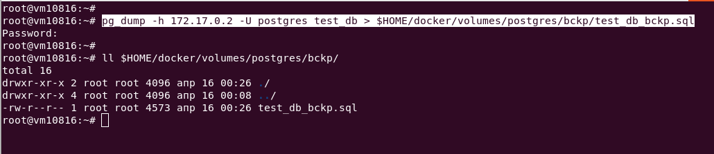
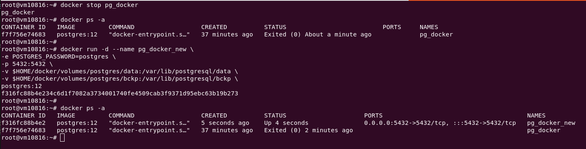

# Домашнее задание к занятию 2. «SQL»

## Введение

Перед выполнением задания вы можете ознакомиться с 
[дополнительными материалами](https://github.com/netology-code/virt-homeworks/blob/virt-11/additional/README.md).

## Задача 1

Используя Docker, поднимите инстанс PostgreSQL (версию 12) c 2 volume, 
в который будут складываться данные БД и бэкапы.

```bash
apt install docker.io
docker --version
```

```Docker version 20.10.21, build 20.10.21-0ubuntu1~18.04.3```

Поднятие контейнера `docker-compose.yml`

```yaml
version: '3.9'

volumes:
  postgressql_data:
  backup_postgressql_data:

services:

  postgressql:
    #image: postgres:12-bullseye 
    image: postgres:12
    container_name: postgressql
    environment:
      - PGDATA=/var/lib/postgresql/data/
      - POSTGRES_PASSWORD=postgres
    volumes:
      - postgressql_data:/var/lib/postgresql/data
      - backup_postgressql_data:/backup
      - ./config:/docker-entrypoint-initdb.d
    network_mode: "host"

```

Приведите получившуюся команду или docker-compose-манифест.

```bash
docker compose up
docker ps -a
docker volume ls

```


```bash
docker exec -it postgressql psql -U postgres
```


## Задача 2

В БД из задачи 1: 

- создайте пользователя test-admin-user и БД test_db;

```sql
CREATE DATABASE test_db;
CREATE USER "test-admin-user";
```


Выводим список БД в командной строке psql клиента

```bash
\l
```


- в БД test_db создайте таблицу orders и clients (спeцификация таблиц ниже);

Таблица orders:

- id (serial primary key);
- наименование (string);
- цена (integer).

Таблица clients:

- id (serial primary key);
- фамилия (string);
- страна проживания (string, index);
- заказ (foreign key orders).

> Переключаемся в базу test_db в командной строке psql клиента

```bash
\c test_db;
```


> Создаем таблицы

```sql
CREATE TABLE orders (
	order_id serial PRIMARY KEY,
	order_name	varchar(25),
	price integer
);
CREATE TABLE clients (
    client_id serial PRIMARY KEY,
    client_last_name varchar(45),
	country	varchar(35),
	order_id integer REFERENCES orders
);
CREATE INDEX country_index ON clients(country);
```


- предоставьте привилегии на все операции пользователю test-admin-user на таблицы БД test_db;

```sql
GRANT ALL ON ALL TABLES IN SCHEMA "public" TO "test-admin-user";
```

- создайте пользователя test-simple-user;

```sql
CREATE USER "test-simple-user";
```

- предоставьте пользователю test-simple-user права на SELECT/INSERT/UPDATE/DELETE этих таблиц БД test_db.

```sql
GRANT SELECT, INSERT, UPDATE, DELETE 
	ON ALL TABLES IN SCHEMA "public" 
	TO "test-simple-user";
```


Приведите:

- итоговый список БД после выполнения пунктов выше;
- описание таблиц (describe);

Команды в командной строке psql клиента

```bash
\l
\d+ orders
\d+ clients
```


- SQL-запрос для выдачи списка пользователей с правами над таблицами test_db;
- список пользователей с правами над таблицами test_db.

```sql
SELECT DISTINCT grantee
FROM information_schema.table_privileges
WHERE table_catalog = 'test_db';
```


## Задача 3

Используя SQL-синтаксис, наполните таблицы следующими тестовыми данными:

Таблица orders

|Наименование|цена|
|------------|----|
|Шоколад| 10 |
|Принтер| 3000 |
|Книга| 500 |
|Монитор| 7000|
|Гитара| 4000|

Таблица clients

|ФИО|Страна проживания|
|------------|----|
|Иванов Иван Иванович| USA |
|Петров Петр Петрович| Canada |
|Иоганн Себастьян Бах| Japan |
|Ронни Джеймс Дио| Russia|
|Ritchie Blackmore| Russia|


```sql
INSERT INTO orders 
	VALUES (1, 'Шоколад', 10), 
		(2, 'Принтер', 3000), 
		(3, 'Книга', 500), 
		(4, 'Монитор', 7000), 
		(5, 'Гитара', 4000);
INSERT INTO clients
	VALUES (1, 'Иванов Иван Иванович', 'USA'),
		(2, 'Петров Петр Петрович', 'Canada'),
		(3, 'Иоганн Себастьян Бах', 'Japan'),
		(4, 'Ронни Джеймс Дио', 'Russia'),
		(5, 'Ritchie Blackmore', 'Russia');
```


Используя SQL-синтаксис:
- вычислите количество записей для каждой таблицы.

```sql
SELECT * FROM orders;
SELECT * FROM clients;
SELECT COUNT(*) FROM orders;
SELECT COUNT(*) FROM clients;
```


Приведите в ответе:

    - запросы,
    - результаты их выполнения.

## Задача 4

Часть пользователей из таблицы clients решили оформить заказы из таблицы orders.

Используя foreign keys, свяжите записи из таблиц, согласно таблице:

|ФИО|Заказ|
|------------|----|
|Иванов Иван Иванович| Книга |
|Петров Петр Петрович| Монитор |
|Иоганн Себастьян Бах| Гитара |

```sql
UPDATE clients SET order_id=3 WHERE client_id=1;
UPDATE clients SET order_id=4 WHERE client_id=2;
UPDATE clients SET order_id=5 WHERE client_id=3;
```

Приведите SQL-запросы для выполнения этих операций.

Приведите SQL-запрос для выдачи всех пользователей, которые совершили заказ, а также вывод этого запроса.

```sql
SELECT * FROM clients;
SELECT * FROM clients WHERE order_id IS NOT NULL;
```


 
Подсказка: используйте директиву `UPDATE`.

## Задача 5

Получите полную информацию по выполнению запроса выдачи всех пользователей из задачи 4 
(используя директиву EXPLAIN).

```sql
EXPLAIN (FORMAT YAML) SELECT * FROM clients WHERE order_id IS NOT NULL;
```

Приведите получившийся результат и объясните, что значат полученные значения.


**Startup Cost: 0.00** - Приблизительная стоимость запуска. Это время, которое проходит, прежде чем начнётся этап вывода данных, например для сортирующего узла это время сортировки.

**Total Cost: 13.50** - Приблизительная общая стоимость. Она вычисляется в предположении, что узел плана выполняется до конца, то есть возвращает все доступные строки. На практике родительский узел может досрочно прекратить чтение строк дочернего.

**Plan Rows: 348** - Ожидаемое число строк, которое должен вывести этот узел плана. При этом так же предполагается, что узел выполняется до конца.

**Plan Width: 204** - Ожидаемый средний размер строк, выводимых этим узлом плана (в байтах).

## Задача 6

Создайте бэкап БД test_db и поместите его в volume, предназначенный для бэкапов (см. задачу 1).

```bash
pg_dump -h 172.17.0.2 -U postgres test_db > $HOME/docker/volumes/postgres/bckp/test_db_bckp.sql
```

```bash
docker exec -t pg_docker pg_dumpall -c -U postgres \
> dump_`date +%d-%m-%Y"_"%H_%M_%S`.sql
```



Остановите контейнер с PostgreSQL, но не удаляйте volumes.
Поднимите новый пустой контейнер с PostgreSQL.
Восстановите БД test_db в новом контейнере.

```bash
docker stop pg_docker
docker ps -a
docker run -d --name pg_docker_new \
-e POSTGRES_PASSWORD=postgres \
-p 5432:5432 \
-v $HOME/docker/volumes/postgres/data:/var/lib/postgresql/data \
-v $HOME/docker/volumes/postgres/bckp:/var/lib/postgresql/bckp \
postgres:12
```



Приведите список операций, который вы применяли для бэкапа данных и восстановления. 

> Ответ

Поскольку новый контейнер истользовал те же самые volume структура данных и сами данные стали видны в новом контейнере, тк в него быди подмонтированы аналогичные папки.

При необходимости восстановить данные из бекапа, с отсутсвующими volumes, необходимо выполнить слудующу команду

```bash
psql -h 172.17.0.2 -U postgres test_db -f $HOME/docker/volumes/postgres/bckp/test_db_bckp.sql
```

---

### Как cдавать задание

Выполненное домашнее задание пришлите ссылкой на .md-файл в вашем репозитории.

---

СПРАВОЧНО

Поднятие контейнера из командной строки 

```bash
docker run -d --name pg_docker \
-e POSTGRES_PASSWORD=postgres \
-p 5432:5432 \
-v $HOME/docker/volumes/postgres/data:/var/lib/postgresql/data \
-v $HOME/docker/volumes/postgres/bckp:/var/lib/postgresql/bckp \
postgres:12

```

Получение адреса контейнера

```bash
docker inspect postgressql | grep "IPAddress"
```

Подключение к базе контейнера

```bash
psql -h 172.17.0.2 -U postgres
```


