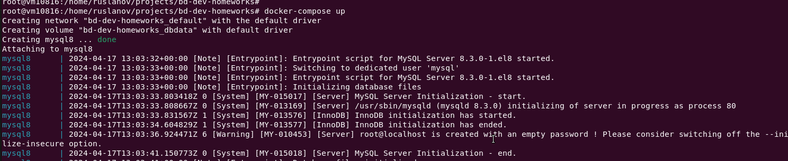
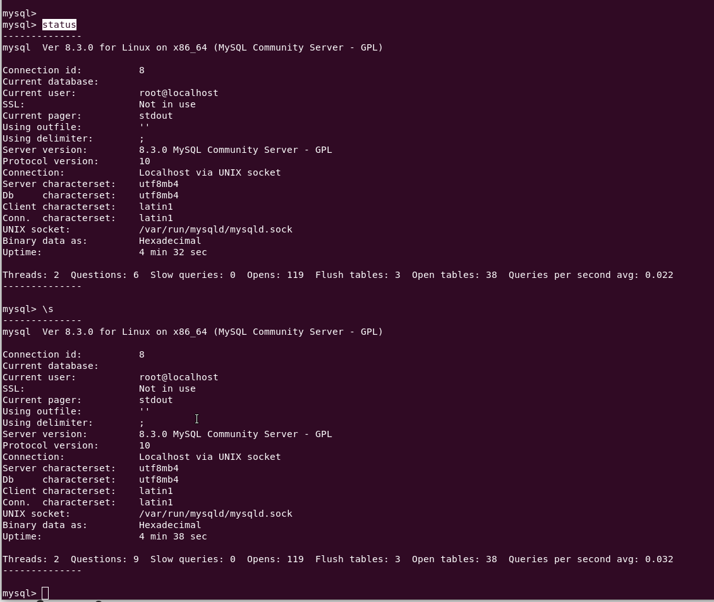
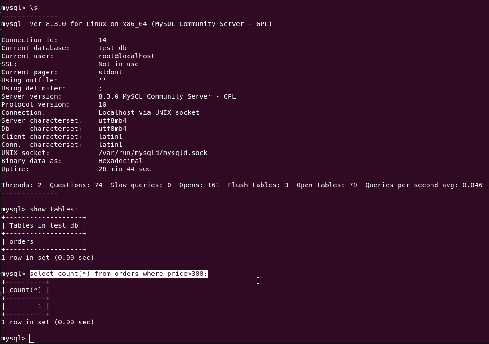
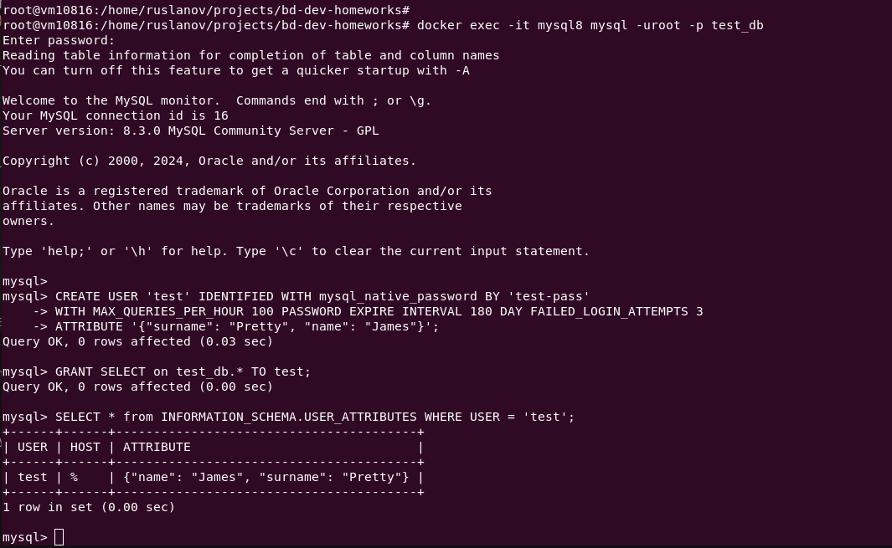
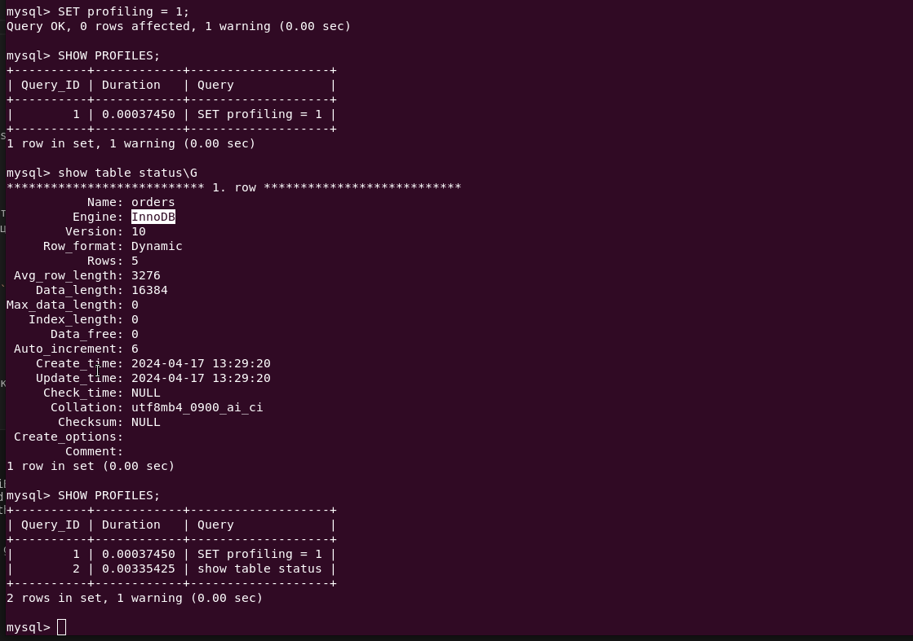

# Домашнее задание к занятию 3. «MySQL»

## Введение

Перед выполнением задания вы можете ознакомиться с 
[дополнительными материалами](https://github.com/netology-code/virt-homeworks/blob/virt-11/additional/README.md).

## Задача 1

Используя Docker, поднимите инстанс MySQL (версию 8). Данные БД сохраните в volume.


```yml
services:
  mysql_db:
    image: mysql:8
    container_name: mysql8
    #restart: always
    ports:
      - "3306:3306"
    environment:
      - MYSQL_ALLOW_EMPTY_PASSWORD=yes
      - MYSQL_ROOT_PASSWORD=password
      - MYSQL_DATABASE=stage
      - MYSQL_USER=example
      - MYSQL_PASSWORD=password
    volumes:
      - dbdata:/var/lib/mysql/
    #network_mode: host
```



```bash
docker exec -it mysql8 mysql -uroot -p
mysql> status
mysql> create database test_db;
```




Изучите [бэкап БД](https://github.com/netology-code/virt-homeworks/tree/virt-11/06-db-03-mysql/test_data) и 
восстановитесь из него.

```bash
docker cp /home/ruslanov/projects/bd-dev-homeworks/test_dump_mysql.sql  mysql8:/tmp/test_dump.sql
docker exec -it mysql8 bash
mysql -u root -p test_db < /tmp/test_dump.sql
```

Перейдите в управляющую консоль `mysql` внутри контейнера.

Используя команду `\h`, получите список управляющих команд.

Найдите команду для выдачи статуса БД и **приведите в ответе** из её вывода версию сервера БД.

Подключитесь к восстановленной БД и получите список таблиц из этой БД.

**Приведите в ответе** количество записей с `price` > 300.

```bash
mysql> \s
mysql> show tables;
mysql> select count(*) from orders where price>300;
```


В следующих заданиях мы будем продолжать работу с этим контейнером.

## Задача 2

Создайте пользователя test в БД c паролем test-pass, используя:

- плагин авторизации mysql_native_password
- срок истечения пароля — 180 дней 
- количество попыток авторизации — 3 
- максимальное количество запросов в час — 100
- аттрибуты пользователя:
    - Фамилия "Pretty"
    - Имя "James".

```sql
CREATE USER 'test' IDENTIFIED WITH mysql_native_password BY 'test-pass'
WITH MAX_QUERIES_PER_HOUR 100 PASSWORD EXPIRE INTERVAL 180 DAY FAILED_LOGIN_ATTEMPTS 3
ATTRIBUTE '{"surname": "Pretty", "name": "James"}';
```

Предоставьте привелегии пользователю `test` на операции SELECT базы `test_db`.

```sql
GRANT SELECT on test_db.* TO test;
FLUSH PRIVILEGES;
```
    
Используя таблицу INFORMATION_SCHEMA.USER_ATTRIBUTES, получите данные по пользователю `test` и 
**приведите в ответе к задаче**.

```sql
SELECT * FROM INFORMATION_SCHEMA.USER_ATTRIBUTES WHERE USER = 'test';
```



## Задача 3

Установите профилирование `SET profiling = 1`.
Изучите вывод профилирования команд `SHOW PROFILES;`.

Исследуйте, какой `engine` используется в таблице БД `test_db` и **приведите в ответе**.

```sql
show table status\G
SHOW PROFILES;
```



Измените `engine` и **приведите время выполнения и запрос на изменения из профайлера в ответе**:
- на `MyISAM`,
- на `InnoDB`.

```sql
mysql> alter table orders engine=MyISAM;

Query OK, 5 rows affected (0.07 sec)
Records: 5  Duplicates: 0  Warnings: 0

mysql> SHOW PROFILES;
+----------+------------+----------------------------------+
| Query_ID | Duration   | Query                            |
+----------+------------+----------------------------------+
|        1 | 0.00037450 | SET profiling = 1                |
|        2 | 0.00335425 | show table status                |
|        3 | 0.06307050 | alter table orders engine=MyISAM |
+----------+------------+----------------------------------+
3 rows in set, 1 warning (0.00 sec)

mysql> SHOW PROFILE FOR QUERY 3;
+--------------------------------+----------+
| Status                         | Duration |
+--------------------------------+----------+
| starting                       | 0.000328 |
| Executing hook on transaction  | 0.000048 |
| starting                       | 0.000115 |
| checking permissions           | 0.000021 |
| checking permissions           | 0.000028 |
| init                           | 0.000090 |
| Opening tables                 | 0.001593 |
| setup                          | 0.000411 |
| creating table                 | 0.003472 |
| waiting for handler commit     | 0.000050 |
| waiting for handler commit     | 0.005824 |
| After create                   | 0.003697 |
| System lock                    | 0.000066 |
| copy to tmp table              | 0.000483 |
| waiting for handler commit     | 0.000029 |
| waiting for handler commit     | 0.000044 |
| waiting for handler commit     | 0.000128 |
| rename result table            | 0.000358 |
| waiting for handler commit     | 0.015184 |
| waiting for handler commit     | 0.000033 |
| waiting for handler commit     | 0.005627 |
| waiting for handler commit     | 0.000042 |
| waiting for handler commit     | 0.013017 |
| waiting for handler commit     | 0.000056 |
| waiting for handler commit     | 0.003228 |
| end                            | 0.006711 |
| query end                      | 0.002030 |
| closing tables                 | 0.000039 |
| waiting for handler commit     | 0.000194 |
| freeing items                  | 0.000071 |
| cleaning up                    | 0.000057 |
+--------------------------------+----------+
31 rows in set, 1 warning (0.00 sec)

mysql> alter table orders engine=InnoDB;
Query OK, 5 rows affected (0.03 sec)
Records: 5  Duplicates: 0  Warnings: 0

mysql> SHOW PROFILE FOR QUERY 4;
+--------------------------------+----------+
| Status                         | Duration |
+--------------------------------+----------+
| starting                       | 0.000162 |
| Executing hook on transaction  | 0.000009 |
| starting                       | 0.000054 |
| checking permissions           | 0.000020 |
| checking permissions           | 0.000043 |
| init                           | 0.000025 |
| Opening tables                 | 0.000685 |
| setup                          | 0.000140 |
| creating table                 | 0.000268 |
| After create                   | 0.012627 |
| System lock                    | 0.000024 |
| copy to tmp table              | 0.000163 |
| rename result table            | 0.001399 |
| waiting for handler commit     | 0.000013 |
| waiting for handler commit     | 0.002241 |
| waiting for handler commit     | 0.000011 |
| waiting for handler commit     | 0.010043 |
| waiting for handler commit     | 0.000016 |
| waiting for handler commit     | 0.004720 |
| waiting for handler commit     | 0.000044 |
| waiting for handler commit     | 0.000432 |
| end                            | 0.001149 |
| query end                      | 0.003250 |
| closing tables                 | 0.000042 |
| waiting for handler commit     | 0.000053 |
| freeing items                  | 0.000061 |
| cleaning up                    | 0.000047 |
+--------------------------------+----------+
27 rows in set, 1 warning (0.00 sec)

mysql> SHOW PROFILES;
+----------+------------+----------------------------------+
| Query_ID | Duration   | Query                            |
+----------+------------+----------------------------------+
|        1 | 0.00037450 | SET profiling = 1                |
|        2 | 0.00335425 | show table status                |
|        3 | 0.06307050 | alter table orders engine=MyISAM |
|        4 | 0.03773650 | alter table orders engine=InnoDB |
+----------+------------+----------------------------------+
4 rows in set, 1 warning (0.00 sec)

mysql> 
```

## Задача 4 

Изучите файл `my.cnf` в директории /etc/mysql.

Измените его согласно ТЗ (движок InnoDB):

- скорость IO важнее сохранности данных; (+)
- нужна компрессия таблиц для экономии места на диске; (+)
- размер буффера с незакомиченными транзакциями 1 Мб; (+)
- буффер кеширования 30% от ОЗУ; (+)
- размер файла логов операций 100 Мб. (+)

Приведите в ответе изменённый файл `my.cnf`.

> в Файл `my.cnf` необходимо добавить следующие параметры

```bash
innodb_flush_log_at_trx_commit = 2

# Изменение этого параметра может повысить пропускную способность записи данных в базу в сотни раз. Он определяет, будет ли Mysql сбрасывать каждую операцию на диск (в файл лога).
# Тут следует руководствоваться такой логикой:
# innodb_flush_log_at_trx_commit = 1 для случаев, когда сохранность данных – это приоритет номер один.
# innodb_flush_log_at_trx_commit = 2 для случаев, когда небольшая потеря данных не критична (например, вы используете дублирование и сможете восстановить небольшую потерю). 
#                                    В этом случае транзакции будут сбрасываться в лог на диск только раз в секунду.

innodb_file_per_table = ON

# Если включить эту опцию, Innodb будет сохранять данные всех таблиц в отдельных файлах (вместо одного файла по умолчанию).
# Прироста в производительности не будет, однако есть ряд преимуществ:
# - При удалении таблиц, диск будет освобождаться. По умолчанию общий файл данных может только расширяться, но не уменьшаться.
# - Использование компрессионного формата таблиц потребует включить этот параметр.

innodb_log_buffer_size = 1M
# Это размер буфера транзакций, которые не были еще закомичены. Значение этого параметра стоит менять в случаях, если вы используете большие поля вроде BLOB или TEXT.

# Устанавливается в процентах от общего обьема памяти
innodb_buffer_pool_size = 2G  
# Если Вы используете только InnoDB таблицы, устанавливайте это значение максимально возможным для Вашей системы. 
# Буфер InnoDB кеширует и данные и индексы. Поэтому значение этого ключа стоит устанавливать в 70%…80% всей доступной #памяти.
 
innodb_log_file_size = 100M
# Эта опция влияет на скорость записи. Она устанавливает размер лога операций (так операции сначала записываются в лог, а потом применяются к данным на диске).
# Чем больше этот лог, тем быстрее будут работать записи (т.к. их поместится больше в файл лога). Файлов всегда два, а их размер одинаковый. Значением параметра задается размер одного файла
```
---

### Как оформить ДЗ

Выполненное домашнее задание пришлите ссылкой на .md-файл в вашем репозитории.

---

