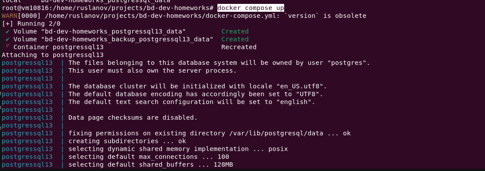
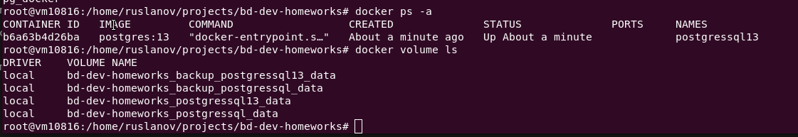
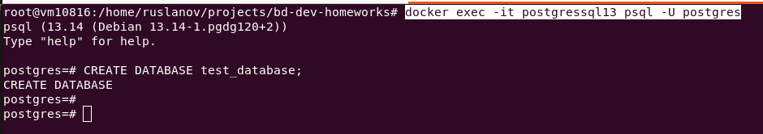
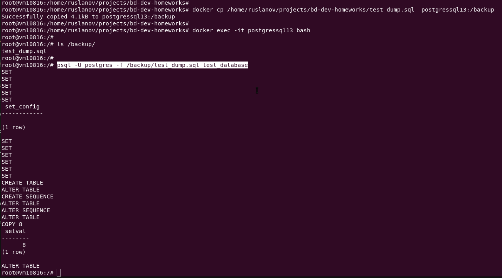
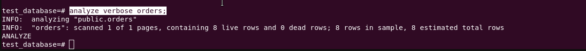
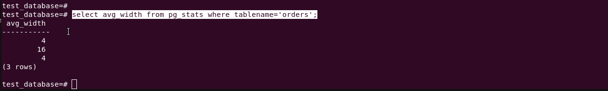
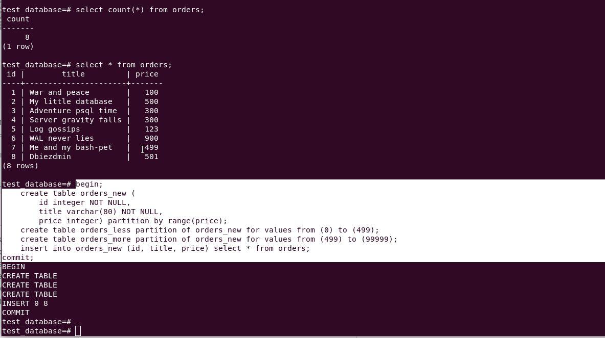
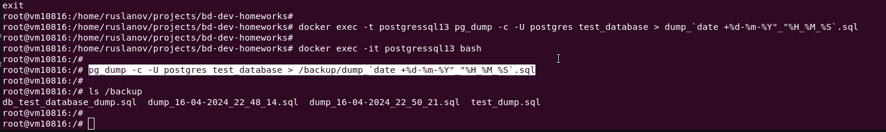

# Домашнее задание к занятию 4. «PostgreSQL»

## Задача 1

Используя Docker, поднимите инстанс PostgreSQL (версию 13). Данные БД сохраните в volume.

Подключитесь к БД PostgreSQL, используя `psql`.

```yaml
version: '3.9'

volumes:
  postgressql13_data:
  backup_postgressql13_data:

services:

  postgressql:
    #image: postgres:12-bullseye 
    #image: postgres:12
    image: postgres:13
    container_name: postgressql13
    environment:
      - PGDATA=/var/lib/postgresql/data/
      - POSTGRES_PASSWORD=postgres
    volumes:
      - postgressql13_data:/var/lib/postgresql/data
      - backup_postgressql13_data:/backup
      - ./config:/docker-entrypoint-initdb.d
    network_mode: "host"
```

```bash
docker compose up
```



```bash
docker ps -a
docker volume ls
```



Воспользуйтесь командой `\?` для вывода подсказки по имеющимся в `psql` управляющим командам.

**Найдите и приведите** управляющие команды для:

- вывода списка БД,

```bash
\l
```

- подключения к БД,

```bash
\c[onnect] {[DBNAME|- USER|- HOST|- PORT|-] | conninfo} connect to new database (currently "postgres")
```

- вывода списка таблиц,

```bash
\dt[S+] [PATTERN]
```

- вывода описания содержимого таблиц,

```bash
\d[S+]  NAME
```

- выхода из psql.

```bash
\q
```

## Задача 2

Используя `psql`, создайте БД `test_database`.

> Подключаемся к контейнеру `postgressql13` к клиенту `psql`

```bash
docker exec -it postgressql13 psql -U postgres
```

```sql
CREATE DATABASE test_database;
```


Изучите [бэкап БД](https://github.com/netology-code/virt-homeworks/tree/virt-11/06-db-04-postgresql/test_data).

Восстановите бэкап БД в `test_database`.

> Переписываем файл бекапа в контейнер и восстанавливаем из бекапа `test_database`

```bash
docker cp /home/ruslanov/projects/bd-dev-homeworks/test_dump.sql  postgressql13:/backup
docker exec -it postgressql13 bash
ls /backup/
psql -U postgres -f /backup/test_dump.sql test_database
```



Перейдите в управляющую консоль `psql` внутри контейнера.

Подключитесь к восстановленной БД и проведите операцию ANALYZE для сбора статистики по таблице.

```bash
docker exec -it postgressql13 psql -U postgres test_database
```

Используя таблицу [pg_stats](https://postgrespro.ru/docs/postgresql/12/view-pg-stats), найдите столбец таблицы `orders` 
с наибольшим средним значением размера элементов в байтах.

> Сбор статистики по таблице `orders`

```sql
analyze verbose orders;
```



> Запрос из таблицы `pg_stats`

```sql
select avg_width from pg_stats where tablename='orders';
```



**Приведите в ответе** команду, которую вы использовали для вычисления, и полученный результат.

## Задача 3

Архитектор и администратор БД выяснили, что ваша таблица orders разрослась до невиданных размеров и
поиск по ней занимает долгое время. Вам как успешному выпускнику курсов DevOps в Нетологии предложили
провести разбиение таблицы на 2: шардировать на orders_1 - price>499 и orders_2 - price<=499.

Предложите SQL-транзакцию для проведения этой операции.

```sql
begin;
    create table orders_new (
        id integer NOT NULL,
        title varchar(80) NOT NULL,
        price integer) partition by range(price);
    create table orders_less partition of orders_new for values from (0) to (499);
    create table orders_more partition of orders_new for values from (499) to (99999);
    insert into orders_new (id, title, price) select * from orders;
commit;
```



Можно ли было изначально исключить ручное разбиение при проектировании таблицы orders?

Необходимо определить тип таблицы в момент проектирования и создания - `partition table`

## Задача 4

Используя утилиту `pg_dump`, создайте бекап БД `test_database`.

> Создание бекапа на хост машине

```bash
docker exec -t postgressql13 pg_dump -c -U postgres test_database > dump_`date +%d-%m-%Y"_"%H_%M_%S`.sql
```

> Создание бекапа внутри контейнера

```bash
docker exec -it postgressql13 bash
pg_dump -c -U postgres test_database > /backup/dump_`date +%d-%m-%Y"_"%H_%M_%S`.sql
ls /backup
```



Как бы вы доработали бэкап-файл, чтобы добавить уникальность значения столбца `title` для таблиц `test_database`?

> Ответ

Можно создать индекс для столбца `title`, для обеспечения уникальности.

---

### Как cдавать задание

Выполненное домашнее задание пришлите ссылкой на .md-файл в вашем репозитории.

---

